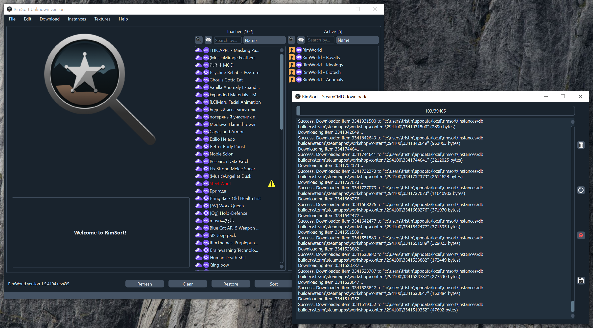

    <h1 align="center">RimSort</h1>
    
Um gerenciador de mods gratuito e de código aberto para várias plataformas para o videogame RimWorld. 
    Construído desde o início para ser confiável e gerenciado pela comunidade. 
    Inclui suporte para Linux, Mac e Windows.

    
<strong><a href="https://github.com/RimSort/RimSort/releases">Releases</a> | <a href="https://rimsort.github.io/RimSort/">Wiki</a> | <a href="https://discord.gg/aV7g69JmR2">Discord</a></strong> 

       

## Instalação

Para instalar o RimSort, acesse a página [Versões][Versões] e baixe a versão mais recente compactada para o seu sistema operacional.

Para Windows e Linux, descompacte o arquivo baixado e execute o executável `RimSort` dentro da pasta descompactada.

Para macOS, certifique-se de obter a versão apropriada para sua CPU (i386 é para um Mac com CPU Intel, ARM é para um Mac com CPU Apple M1/M2). Pode ser necessário seguir [instruções especiais](https://rimsort.github.io/RimSort/user-guide/downloading-and-installing#macos) para contornar erros do Gatekeeper.

Consulte o [wiki][Wiki] para obter instruções mais detalhadas.

## Contribuição

Os bugs e solicitações de recursos são rastreados na seção [Issues][Issues] deste repositório. Se você encontrar um bug ou tiver uma sugestão de recurso, sinta-se à vontade para criar uma Issue aqui!

Consulte o [wiki][Wiki] para obter instruções detalhadas sobre como compilar o RimSort por conta própria, bem como diretrizes para fazer pull requests.

Interessado em ajudar a traduzir o RimSort para o seu idioma? Confira nossas [Diretrizes de tradução](https://rimsort.github.io/RimSort/development-guide/translation-guidelines) para obter instruções detalhadas sobre como contribuir com traduções.

## Perguntas frequentes e problemas

Se você tiver algum problema, certifique-se de **verificar o [wiki][Wiki]** para encontrar uma solução.

[][Discord]

[Wiki]: https://rimsort.github.io/RimSort/
[Repo]: https://github.com/RimSort/RimSort
[Issues]: https://github.com/RimSort/RimSort/issues
[Releases]: https://github.com/oceancabbage/RimSort/releases
[Discord]: https://discord.gg/aV7g69JmR2
